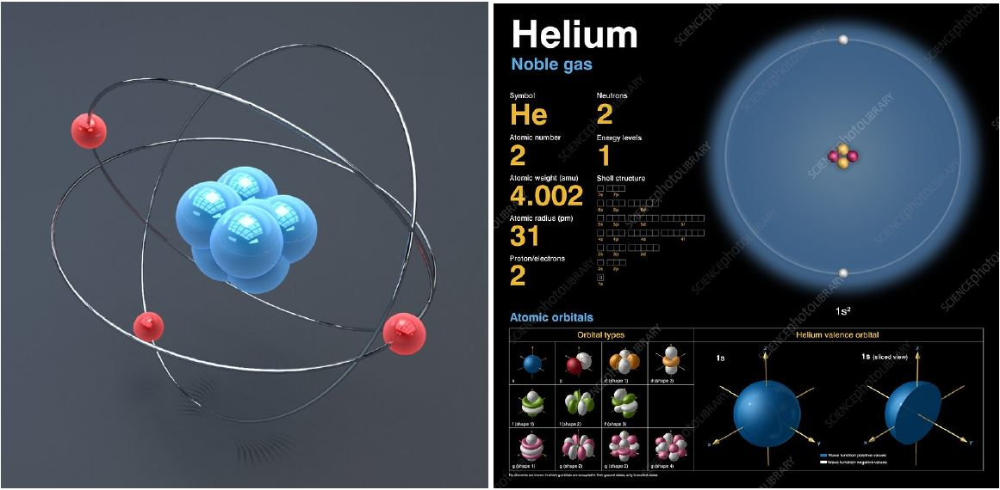

# Atom

## _Virtual Reality based application to visualise and learn the periodic table_

An interactive way to visualise the elements of the periodic table and their atomic structure in Virtual Reality in a chemical laboratory experience.

## Team Members

Sary Elmelegy, Bimalesh Sahoo, Robins Mathew

## Problem Definition

Students are introduced to the periodic table of elements in the elementary school. In their earlier grades they are introduced to the categorisation of elements in the periodic table. For eg : the noble gases are on the far right column. But as they progress in higher grades, they start learning about the elements, their usage. Further in their chemistry learning they come to a point where they have to understand the elements based on their atomic structure. Each element has a unique atomic structure with a unique set of protons, neutrons and electrons. These atomic structures are taught in a 2D format using the textbook.
There are 118 elements in the periodic table. Higher secondary students have to learn elements based on the atomic structure and solve equations based on the same. This can be quite time consuming and slower to learn because everything is taught in 2D.

## Idea

Our idea is to design an interactive way to visualise the periodic table of elements and their atomic structure in Virtual Reality. The atomic structure of each element will be modelled in 3D. The idea is to show these atomic structures in a life size scale and also probably walk around the model and interact with it. The 3d atomic structures would look like the example shown below.

As an extension to this idea we have plans to add extra gamification features in addition to the visualisation.
Some other features such as :

- Pick elements from the table to make compounds and visualise their molecular structure.
- In built quiz-like games where the user is prompted to form a compound that the game is challenging. For example form the compound of water H20 by picking elements.
- Leaderboard for the game which asks to fill an empty periodic table.

The motivation for this idea arises from our own experiences in school trying to understand and learn the periodic table. We plan to partner with schools and chemistry teachers and take part in the lessons to understand the student perspective better to refine our problem statement as well.

The outcome of the project would be an attempt to make chemistry a bit more interesting. Most importantly to make periodic table learning more interactive and memorable.

## Requirements

- Software : Unity 3D, Visual Studio, 3DS Max
- Hardware : Oculus, VR Controllers
- Interaction Techniques : Drag & Drop, Select & Unselect, 3D Revolve
- Outline : We plan to interact with some students of a school, collect their feedback and come up with a first hand model. Later, test it again with the students and optimize it for better results.
