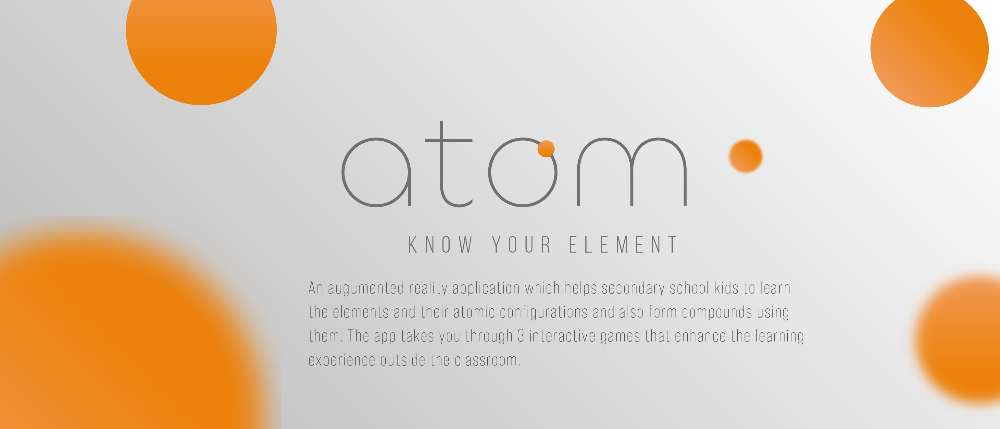

# Atom

## _Virtual Reality based application to visualise and learn the periodic table_

An interactive way to visualise the elements of the periodic table and their atomic structure in Virtual Reality in a chemical laboratory experience.

## Team Members

Sary Elmelegy, Bimalesh Sahoo, Robins Mathew

